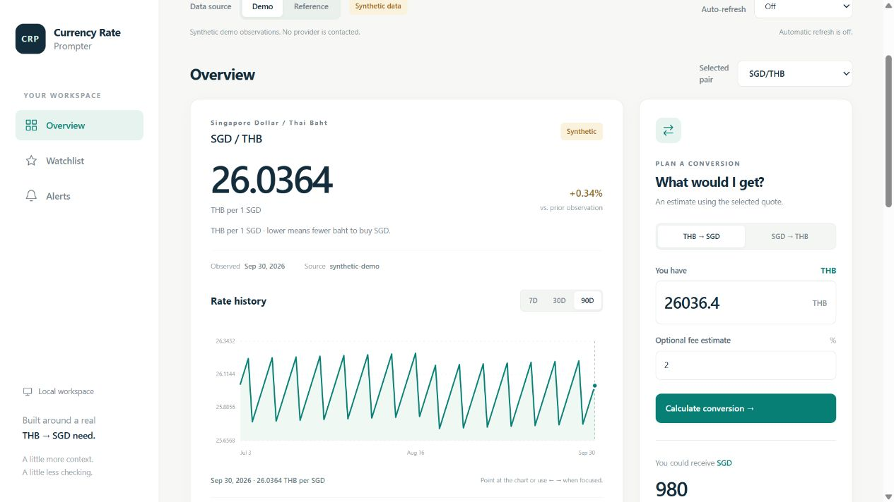
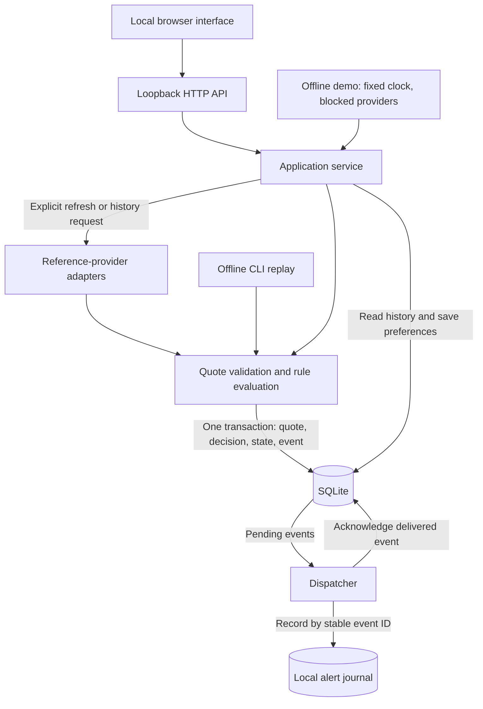
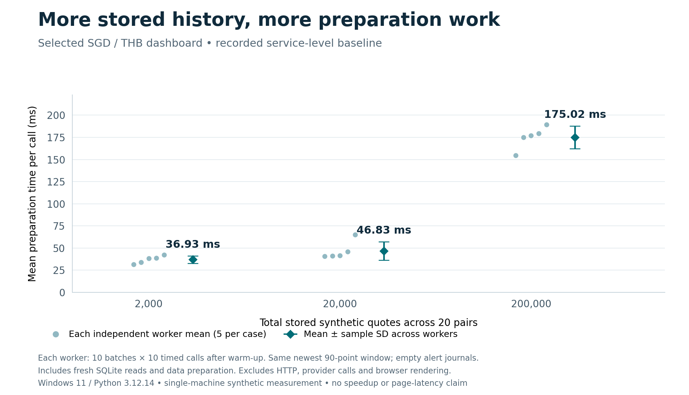

# Currency Rate Prompter

I built Currency Rate Prompter while studying as an international student at Hwa Chong International School. Changes in the Thai baht against the Singapore dollar affected when I wanted to buy SGD, so I wrote a script to check rates automatically. I used it myself, then added my parents to its email alerts.

That practical tool has since developed into a **Python and SQLite application that runs locally in a browser**. It brings saved watchlists, historical charts, conversion estimates and target rules into one place, with particular care around what happens when a quote is repeated, a provider fails or the application restarts.

[Try the offline demo](#try-it-locally) · [Design decisions](docs/design.md) · [Measurement evidence](docs/measurement.md) · [Testing](docs/testing.md)



*The offline demonstration uses synthetic quotes and a fixed clock. It makes no provider requests.*

## From a personal script to a persistent application

The original application used scraping, local pickle history, plots and desktop/email prompts. The current revision keeps the same THB-to-SGD use case, but rebuilds observation and alert handling around explicit timestamps, decimal arithmetic and transactional storage.

| Original tool | Current implementation |
| --- | --- |
| A script I used to watch THB/SGD rates, later shared with my parents through email alerts | A local browser application with persistent watchlists and a searchable currency catalogue |
| Scraped observations and local pickle history | Validated reference-provider adapters and SQLite history, with conflicting revisions rejected |
| Plots and prompts | Historical charts, accessible observation tables, CSV exports and conversion estimates with an optional percentage fee |
| Historical email delivery | Threshold rules, persistent cooldowns and a local alert journal with retry-safe event identities |
| Personal experimentation | Automated recovery tests, a repeatable offline demo, documented contracts and a reproducible service benchmark |

For **THB per 1 SGD**, a lower rate means fewer baht are needed to buy Singapore dollars. That direction remains the main example in the app. Historical email delivery belongs to the original script; the current implementation records alerts locally and does not send email.

## Try it locally

With **Python 3.10+**, download or clone this repository, open a terminal in its root and run:

```console
python scripts/demo_app.py
```

Open the printed loopback URL, select **Demo → SGD / THB**, and keep the terminal open. No application package installation, API key or internet connection is needed. On Windows, `Run Offline Demo.cmd` starts the same demo. Stop with Ctrl+C.

The [three-minute walkthrough](docs/demo.md) has concrete checks: inspect 90 synthetic observations, estimate a conversion, refresh twice and confirm that the qualifying observation creates just one journal entry. Each launch creates a fresh session; saved sessions can also be reopened.

For the normal persistent app with explicit reference-provider access:

```console
python -m pip install .
python -m currency_prompter app --db app-data/tracker.sqlite --port 0
```

The [app guide](docs/local-app.md) covers watchlists, targets, history, exports and reference refreshes. The bundled catalogue contains **165 provider codes in its 3 October 2026 snapshot**, including provider-listed metals; catalogue membership does not guarantee every pair or historical date is available.

## A quote should lead to an explainable decision

The browser uses a loopback HTTP API backed by an application service. The same validated quote and rule logic supports the CLI. SQLite retains observations, decisions, cooldown state, pending events and local notification receipts.



The transaction ends before dispatch. If the process stops after recording a journal receipt but before acknowledging the event, a retry recognises that receipt instead of adding another. This is a concrete local idempotency contract; an eventual email adapter would need its own delivery and deduplication design.

| Design decision | What it protects | Tradeoff |
| --- | --- | --- |
| Decimal rates and explicit rounding | Stored values and threshold comparisons do not depend on binary floating-point rounding | Plotting still uses floats for coordinates; conversion output has a documented precision policy |
| One transaction per observation | Quote, decision, chronology and pending event commit together or roll back together | SQLite serialises writers; this is a single-user application |
| Stable quote, rule and event identities | Repeated observations do not create repeated decisions; conflicting rates cannot silently replace history | Provider corrections need an explicit revision policy |
| Separate observation, receipt and processing times | Late data and a backwards clock cannot silently rewind alert state | A provider's daily date still cannot supply an intraday observation time |
| Explicit provider access and retained local state | A failed refresh leaves existing history and catalogue usable | Reference data may be delayed or unavailable |
| Standard-library runtime and loopback hosting | The source demo is easy to run without an external service | No cloud sync, account system or authenticated public hosting |

The [design notes](docs/design.md) follow these contracts through duplicate detection, cooldown boundaries, rollback and interrupted delivery. Useful starting points in the code are [domain validation](src/currency_prompter/domain.py), [storage](src/currency_prompter/storage.py), [dispatch](src/currency_prompter/monitor.py) and [application operations](src/currency_prompter/app_service.py).

## Testing the failure paths

The recorded local Python suite on **3 October 2026** collected 142 tests: **141 passed and one Windows symlink test was skipped**. The nine demo tests were also rerun successfully from an extracted source bundle with Python site packages disabled. These nine are part of the full suite, not an additional set of distinct tests. Ruff lint and formatting passed. The [local verification receipt](docs/evidence/local-verification.json) retains summaries and source hashes.

Regression tests cover decimal boundaries, repeated and conflicting observations, clock rollback, transaction failures, interrupted delivery, retained state after provider failures, malformed requests and local Host/Origin/CSRF checks. Demo tests exercise saved-session recovery, occupied ports, concurrent-session refusal and overwrite protection.

A fresh check of the publication copy reproduced **141 passes and one skip**, **19 passing mock-API DOM tests**, and all nine demo checks from the built source distribution with site packages disabled. Python coverage was **92.63% combined statements and branches**, including subprocesses and the CLI replay, with no exclusions. The [integration receipt](docs/evidence/integration-verification.json) records the scope and source hashes.

A separate [browser check](docs/evidence/browser-verification.json) exercised the THB-to-SGD estimate, catalogue search, saved watchlist, CSV download action and duplicate-free local alert journal. [Testing notes](docs/testing.md) distinguish these observations from automated coverage. The [workflow](.github/workflows/checks.yml) defines 12 checks across Python 3.10–3.13 and Node 24 on Windows and Linux, including an extracted-source packaging check. Consult [GitHub Actions](https://github.com/IGoByLotsOfNames/currency-rate-prompter/actions/workflows/checks.yml) for hosted results tied to a specific commit.

## Measuring history preparation

How much work does preparing one selected pair require as saved history grows? A repeatable benchmark holds the visible 90-point window constant while increasing synthetic stored quotes across 20 currency pairs.



| Total synthetic quotes | Mean preparation time | Sample SD across five worker means |
| ---: | ---: | ---: |
| 2,000 | 36.93 ms | 4.26 ms |
| 20,000 | 46.83 ms | 10.33 ms |
| 200,000 | 175.02 ms | 12.74 ms |

The baseline was measured on Windows 11 with Python 3.12.14 and SQLite 3.53.1. Each case used five fresh worker processes, each with ten batches of ten timed calls after warm-up. All **15 workers, 150 batches and 1,500 calls** were retained and checked against the saved source and fixture hashes.

These are **service-level preparation times**, including fresh SQLite connections. They exclude startup, provider requests, HTTP/JSON handling, the separate watchlist endpoint and browser rendering. Rules and journals were empty. This is a single-machine baseline, not full-page latency, a before/after speedup or evidence of conversion savings. The [protocol and raw results](docs/measurement.md) make the workload and interpretation limits reproducible.

The measured path currently reads up to 10,000 observations for the selected pair before preparing the displayed window. Profiling that retrieval is a useful next step before choosing an optimisation and repeating the same experiment.

## Boundaries and next steps

The app uses daily reference observations rather than guaranteed bank quotes. The converter can deduct a user-supplied percentage fee, but does not fetch bank spreads or fixed fees. It does not forecast rates, execute exchanges or run an unattended background service; optional automatic refresh only operates while the page stays open.

Further work includes measuring large alert journals and concurrent access, extending cross-platform validation, and designing explicit credential and delivery handling before reintroducing email. Personal use motivated the original tool; measured savings and adoption have not been established.

Built by **Jirapas Wongtreenatrkoon**. The current revision was developed with Codex assistance; the original idea and personal use predate this revision. The original project history and existing ownership terms remain part of this repository. See [LICENSE](LICENSE) and [security and data boundaries](SECURITY.md).
