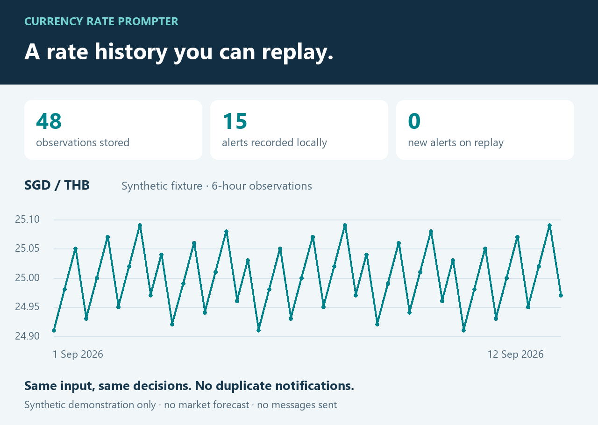
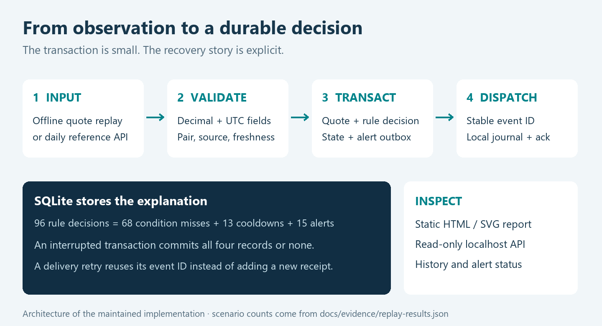

# Currency Rate Prompter

[](https://github.com/IGoByLotsOfNames/currency-rate-prompter/actions/workflows/checks.yml)

**Keep a history of the exchange rate. Get an alert when a condition matters. Understand why it happened.**

Currency Rate Prompter began as a Python script that watched SGD/THB, saved local history and prompted on selected rate conditions. This maintained implementation keeps that idea while rebuilding the data and alert path around exact decimal values, explicit timestamps and durable state.

Run a complete synthetic scenario without an API key or internet connection, inspect the results in a browser, then opt into a daily reference-rate provider when you want real observations.



*The chart is generated from the bundled synthetic fixture. It is not market history or a forecast.*

## Try it

Python **3.10+**. The application and test suite use only the standard library.

```bash
git clone https://github.com/IGoByLotsOfNames/currency-rate-prompter.git
cd currency-rate-prompter
python scripts/run_demo.py --output demo-output
```

Open `demo-output/history.html`. The demo records 48 observations, evaluates two rules, replays the same input again and writes a local notification journal. It never sends messages or contacts a provider. If the output folder already contains a demo database, choose another folder; the command does not delete your history.

To use all commands:

```bash
python -m pip install .
currency-prompter --help
currency-prompter serve --db demo-output/demo.sqlite
```

Open **http://127.0.0.1:8765/** for the local read-only dashboard. The same data is available at `/api/quotes`, `/api/alerts` and `/health`.

## What it does

- **Records exact, timestamped quotes.** Rates stay as `Decimal` values and decimal strings; observation and receipt times are separate UTC fields.
- **Explains every decision.** Inclusive upper/lower thresholds, source matching, freshness checks and persistent cooldowns produce an auditable decision record.
- **Survives retries and restarts.** SQLite stores history, rule state and alert events together. Stable event IDs prevent duplicates in the local notification journal.
- **Replays without waiting.** Synthetic fixtures and an injectable clock reproduce time boundaries, late observations and repeated input.
- **Makes state visible.** A static HTML/SVG report and a loopback-only JSON API expose history and pending/delivered alerts.
- **Fetches daily reference rates on request.** The optional Frankfurter adapter has bounded responses, timeouts and transient-error retries.

This is a local monitoring tool. It does not execute currency conversions, send email, predict future rates or account for a transfer provider's fees.

## One replay, then the same replay again

The committed [results](docs/evidence/replay-results.json) are regenerated by `python scripts/generate_evidence.py`.

| Result | First replay | Second replay |
| --- | ---: | ---: |
| Input observations | 48 | 48 |
| New stored observations | 48 | 0 |
| New queued alerts | 15 | 0 |
| Previously evaluated rule/quote pairs | 0 | 96 |

Across the first run's 96 rule decisions, **68 did not meet the condition**, **13 were suppressed by cooldown**, and **15 queued an alert**. Dispatch then wrote 15 unique local notification records. These are deterministic scenario results, not performance benchmarks or claims about real users.



The quote, decision, cooldown state and outbox event commit in one transaction. Delivery happens afterwards. If a process stops after the journal records an event but before acknowledgment, retry finds the same event ID and does not add a second notification.

An external email or webhook integration would still need receiver-side idempotency. The outbox by itself offers at-least-once attempts, not universal exactly-once delivery.

## Work with your own history

Quotes use an explicit schema:

```json
{
  "base": "SGD",
  "counter": "THB",
  "rate": "25.04",
  "observed_at": "2026-09-01T00:00:00Z",
  "received_at": "2026-09-01T00:00:00Z",
  "source": "synthetic-demo"
}
```

Here, **1 SGD = 25.04 THB**. A quote file is a JSON array of these objects. A rule specifies its pair and source as well as its threshold:

```json
{
  "name": "upper-threshold",
  "base": "SGD",
  "counter": "THB",
  "source": "synthetic-demo",
  "direction": "at_or_above",
  "threshold": "25.04",
  "cooldown_seconds": 86400,
  "max_age_seconds": 345600
}
```

```bash
currency-prompter replay --db output/history.sqlite --quotes src/currency_prompter/data/demo-quotes.json --rules src/currency_prompter/data/demo-rules.json
currency-prompter dispatch --db output/history.sqlite
currency-prompter report --db output/history.sqlite --output output/history.html
```

`replay` uses each quote's historical receipt time and preserves input order. It does not pretend an old observation is fresh today. Repeated quote/rule pairs are ignored; conflicting values at the same source timestamp are rejected. Changing a rule's configuration creates a new revision with its own cooldown state.

## Optional live observation

[Frankfurter](https://frankfurter.dev/) provides daily reference-rate data without an API key. The adapter calls it only when you explicitly run `poll`:

```bash
currency-prompter poll --db output/live.sqlite --rules examples/frankfurter-rules.json --base SGD --counter THB
currency-prompter dispatch --db output/live.sqlite
currency-prompter serve --db output/live.sqlite
```

The example threshold is illustrative; choose your own condition. `poll` fetches once and `dispatch` records alerts locally. Repeating a daily observation does not create another quote. Scheduling is left to your operating system.

A provider date is represented at 00:00 UTC because the API returns a calendar date, not an intraday timestamp. Daily reference rates are not guaranteed executable bank quotes. Adapter tests use a fake transport; CI does not rely on the live service.

## Verification

```bash
python -m pip install .
python -m unittest discover -s tests -v
python scripts/generate_evidence.py
```

The 52-test suite includes:

| Boundary | What is checked |
| --- | --- |
| Decimal and time | Exact serialisation under a changed Decimal context; invalid, future, naive and extreme timestamps |
| Transaction integrity | An injected failure after outbox insertion rolls back quote, rule state, decision and event together |
| Replay and state | Duplicate/conflicting identities, late quotes, clock rewind, rule revisions and persistent cooldowns |
| Recovery | Failure before delivery, retry, and a crash after journal insertion but before acknowledgment |
| Provider contract | Wrong pair/type/date, excessive payloads, invalid JSON, exact numeric parsing and bounded retries |
| Local interface | Read-only routes, Host validation, malformed requests, result limits and escaped HTML |

CI installs the package and runs the same offline suite and demo on Python 3.10–3.13 on Linux and Windows. The workflow's current result is linked above.

To rebuild the documentation images, run `python -m pip install -r requirements-visuals.txt`, then `python scripts/generate_evidence.py` and `python scripts/render_visuals.py`. Pillow is optional documentation tooling. The renderer uses an available system font; font appearance can vary between operating systems, while the underlying fixture and counts stay the same.

## Project notes

The historical prototype used HTML scraping, pickle history, desktop/email prompts and plotting scripts. This repository contains a new, maintainable implementation of that monitoring idea. It does not include old private logs, recipient lists, credentials or executables, and does not claim the new reliability properties existed in the original version.

- [Design, guarantees and trade-offs](docs/design.md)
- [Security and data boundaries](SECURITY.md)
- [Reproducible replay results](docs/evidence/replay-results.json)
- [Generated HTML report](docs/evidence/demo-report.html) — download and open locally
- [Editable rate chart](docs/assets/history.svg)

Built by **Jirapas Wongtreenatrkoon**. Copyright is retained; [the license](LICENSE) permits local personal, educational and evaluation use. Commercial use and redistribution require permission.
