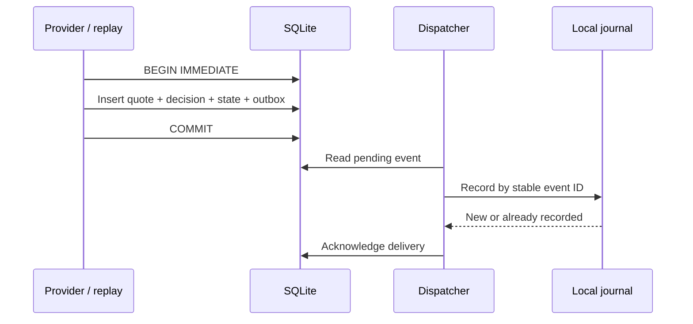

# Decisions that survive a restart

## The quote contract

A quote is counter-currency units per one base-currency unit: `SGD/THB = 25` means 1 SGD = 25 THB. There is no implicit inversion. Codes use three uppercase ASCII letters; the live provider decides whether a real code is supported. Values use positive, finite `Decimal` numbers in a bounded range, with at most 28 significant digits. Input JSON stores rates as strings. Serialisation does not depend on the caller's Decimal precision.

`observed_at` describes the source observation. `received_at` describes when the application received it. Both require an explicit offset and are normalised to UTC. Frankfurter returns a **daily date**: this adapter uses midnight UTC to represent that date, without claiming an intraday observation time. Polling the same daily observation again does not produce another quote.

Identity is `(base, counter, source, observed_at)`, hashed from canonical JSON. Identical rates with equivalent decimal formatting are duplicates. A different rate under the same identity is rejected as a conflicting revision; silent historical overwrites would make decisions hard to explain. A future version could represent explicit provider corrections with revision IDs.

## Rules and chronology

Rules contain a name, pair, source, inclusive threshold direction, cooldown and maximum observation age. Source matching prevents synthetic quotes or another provider's values from triggering a live-source rule. A rule's full configuration determines its identity; changing the threshold, name or cooldown creates a new revision with independent state. Changing a rule can therefore produce a new alert on an old quote if it is explicitly replayed under the new rule.

Each rule/quote pair is evaluated once. Outcomes are `queued`, `below_condition` (condition not met in either direction), `cooldown`, `stale`, or `out_of_order`. A repeated pair returns `duplicate` without inserting a second decision. Late observations remain available in history, but cannot rewind alert state. A backwards processing clock cannot create a new chronological decision. Failed freshness/order checks are recorded once and are not retroactively reconsidered.

The first qualifying quote alerts immediately. Subsequent qualifying quotes alert after the cooldown expires, including the exact boundary. The condition does not have to cross back through the threshold. Cooldown begins when an alert is **queued**, not when the notifier succeeds; otherwise a notifier outage could create a backlog of equivalent alerts. The default four-day maximum age accommodates many weekends, but does not guarantee coverage of every holiday; configure it for the source.

## Transaction and delivery boundaries

SQLite serialises writers. A failure between the quote and outbox writes rolls back the complete transaction. The dispatcher processes at most 1,000 pending events per command. A failure keeps the event pending and records the exception type, not a potentially sensitive message.

The bundled notifier is a **local dry-run journal** with a unique event ID. If the process stops after the journal insert but before acknowledgment, retry sees the existing receipt and acknowledges without adding another notification. Two dispatchers can attempt the same event; the journal's uniqueness constraint prevents duplicate records. A new email/webhook adapter would need the same receiver-side idempotency contract. The outbox alone provides at-least-once attempts, not universal exactly-once delivery. This repository deliberately does not send email, desktop messages or trades.

## Replay, import and time

`replay` uses each input quote's `received_at` as its clock, in the supplied order. It reproduces historical decisions without waiting or fetching a current rate. It does **not** claim the quote is fresh today. The entire JSON batch is schema-validated first; each quote then commits separately. A conflicting identity partway through a valid-schema batch stops the replay while preserving earlier committed quotes. Correct the input and replay: already recorded decisions are harmless duplicates.

The storage engine accepts an explicit `now`, and delivery accepts a clock object. Tests therefore cross cooldown, midnight, month and year boundaries without sleeping. `poll` uses the real UTC clock and fetches once. Scheduling is left to the operating system; a daily provider does not need a tight polling loop.

## Local HTTP interfaces

`serve` binds to `127.0.0.1` only, enforces a local Host header, limits query fields/results, and opens SQLite read-only. Routes return the dashboard, counts, quotes and alert state. It has no mutation or notification endpoint. SQL values are parameterised. HTML text is escaped, and an explicit CSP disables scripts and framing. This small standard-library server is for local inspection, not a public deployment or an authentication solution.

The interactive `app` command is a separate loopback interface. It adds watchlist, rule, history and refresh operations through bounded JSON requests, with Host and Origin validation and a per-server CSRF token for state changes. Browsing stored state makes no provider call; refresh and history actions explicitly request reference data. This interface is also for one local user and has no public-hosting authentication or account system. See the [app guide](local-app.md).

Reports show at most the latest 1,000 observations, grouped by pair and source so incompatible rates are never joined. SVG coordinates use floats for drawing only; stored values and thresholds remain decimal strings. Reports plot observations, not interpolation-based forecasts.

## Provider boundary

The optional Frankfurter adapter targets a fixed HTTPS endpoint, reads at most 64 KB, uses a 10-second per-operation socket timeout, and retries transient failures at most twice with bounded backoff. It does not retry malformed data or non-transient HTTP failures. This is not a total wall-clock deadline against every possible slow server. Runtime tests replace the transport and do not depend on the external service.

Frankfurter supplies reference rates from official sources; these are not a bank's guaranteed executable rate and exclude transfer fees. Current API documentation: [Frankfurter](https://frankfurter.dev/). The included fixture is wholly synthetic and separate from provider data.
