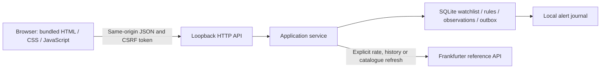

# Currency Rate Prompter local app

The local app extends the original THB-to-SGD monitoring idea with a browser interface. The original was used personally during the author's time at Hwa Chong International School and later included parents in email alerts. This revision keeps rate observation, exact arithmetic and explainable alert decisions central. Its included alert delivery is a local journal, not the historical SMTP implementation.

## Start

Install the project, then run the app on your own machine:

```powershell
# currency-rate-prompter/ (repository root)
python -m pip install .
currency-prompter app --db app-data/tracker.sqlite --port 8766
```

Open http://127.0.0.1:8766/. The server listens on loopback only. Stop it with Ctrl+C. If the port is occupied, use --port 0 and open the address printed by the command. All runtime functionality uses the Python standard library; no npm service or cloud deployment is required.

## Use

- **Demo / Reference:** demo is deterministic synthetic history ending 30 September 2026. Reference observations come from Frankfurter only after an explicit refresh or history-load action. Modes keep charts, rules and journal views separate.
- **Currency catalogue:** search by code or name across 165 active codes in the bundled Frankfurter snapshot (3 October 2026), including provider-listed metals. Use Refresh currency list to request a newer catalogue. Successful updates persist locally; failed updates leave the previous list usable. Saved codes removed by a future catalogue remain visible with an unavailable label. The list excludes archived currencies and is not a cryptocurrency feed.
- **Watchlist:** add or remove a pair from the supported currency list (up to 20 saved pairs). Selecting a pair updates its chart, converter, rules and journal. Watchlist membership persists in SQLite.
- **History:** choose a chart window, inspect exact observations in the accessible history table, and export a CSV. Load 90-day history fetches a bounded reference batch. Historical imports create no retrospective alerts.
- **Converter:** choose the input direction and amount, with an optional percentage fee deducted before conversion. Calculations use Decimal on the server, with output normally rounded to eight decimal places. Positive results below 0.00000001 retain eight significant digits and include a precision note, so a tiny value does not silently appear as zero. SGD/THB defaults to THB input, reflecting the original need to buy SGD.
- **Rules:** configure an inclusive above/below threshold and cooldown, then enable, disable or remove it. The rule is evaluated when the active pair is refreshed; creating a rule does not send any message. Local records retain historical rule labels after removal.
- **Alerts:** refresh evaluates the latest observation and records qualifying events in the local journal. Retrying the same event does not duplicate that journal record. There is no email/desktop delivery in this revision.
- **Optional page refresh:** the interface can schedule refreshes while it remains open. The default is Off; this is not a background service or an operating-system schedule.

For THB per 1 SGD, lower values mean fewer baht needed to buy SGD. A reference rate is not a bank offer; real spreads, fixed fees and available exchange rates may differ. The percentage-fee field is an explicit estimate, not a provider fee feed.

## Data and network boundaries

A fresh app starts with a demo and three watchlist pairs. It does not fetch remote data on startup or when merely changing a chart or mode. Latest-rate, history and currency-list calls go to fixed Frankfurter HTTPS endpoints; currency strings cannot specify an arbitrary URL. Provider failures preserve existing observations. Conflicting revisions are rejected rather than silently rewriting recorded evidence.

The reference history request covers at most 90 calendar days; availability depends on the provider. A catalogue entry does not guarantee every pair or historical date. Unavailable pair/date responses appear as clear errors without deleting saved history. The bundled snapshot and any cached catalogue work without a network connection. Stored observation dates and receipt timestamps are separate. A date supplied by the provider is represented at midnight UTC as a date convention, not an intraday timestamp. The chart compares the latest observation with the previous available observation, which need not be the previous day.

Watchlists, rules and observations persist in the selected SQLite file. Close the app before making a filesystem copy of its data directory; include any SQLite companion files. This app is for one local user. It has no cloud sync, account system, authenticated remote access, trading or exchange execution.

## Implementation



The UI keeps display state in the browser; important data lives in SQLite. Each request uses its own database connection. Parameter validation, bounded request bodies, a per-server CSRF token, local Host checks and origin checks protect mutation routes from accidental cross-site use. The server is deliberately not a public-hosting design.

The existing read-only `serve` command remains available for inspecting an existing database. The new `app` command provides the interactive workflow.

## Provider reference

API routes and daily/reference semantics were checked against the official [Frankfurter documentation](https://frankfurter.dev/). The application does not provide bank-executable pricing, intraday trading data or guaranteed provider availability.
